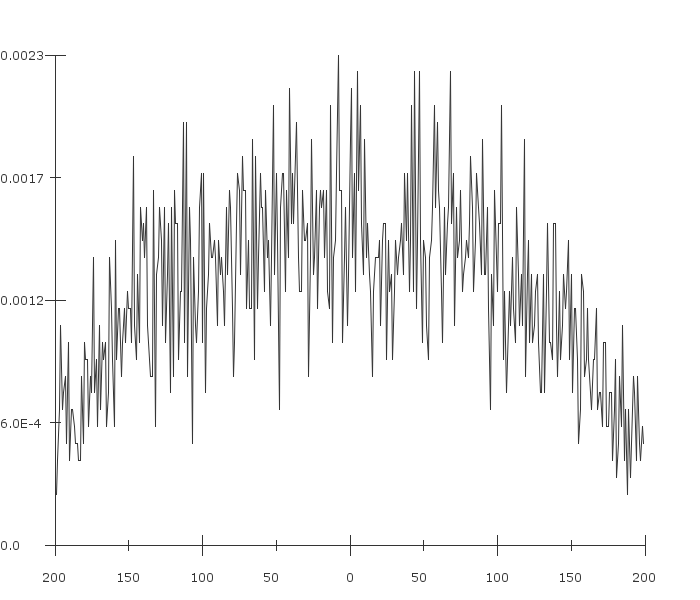

# snpgraph
Tool for visualizing SNP distributions across transcription factor binding sites in the human genome developed during my bachelor's thesis in 2018.

# Usage
snpgraph can be run as follows (Linux only at the moment):
```
java -jar snpgraph-0.1.0.jar filename
```

# Visualization
A visualization of SNP distributions for a provided file might look like this (file used 
[HeLa-S3_NFYA_narrowPeak.bed](HeLa-S3_NFYA_narrowPeak.bed)):
